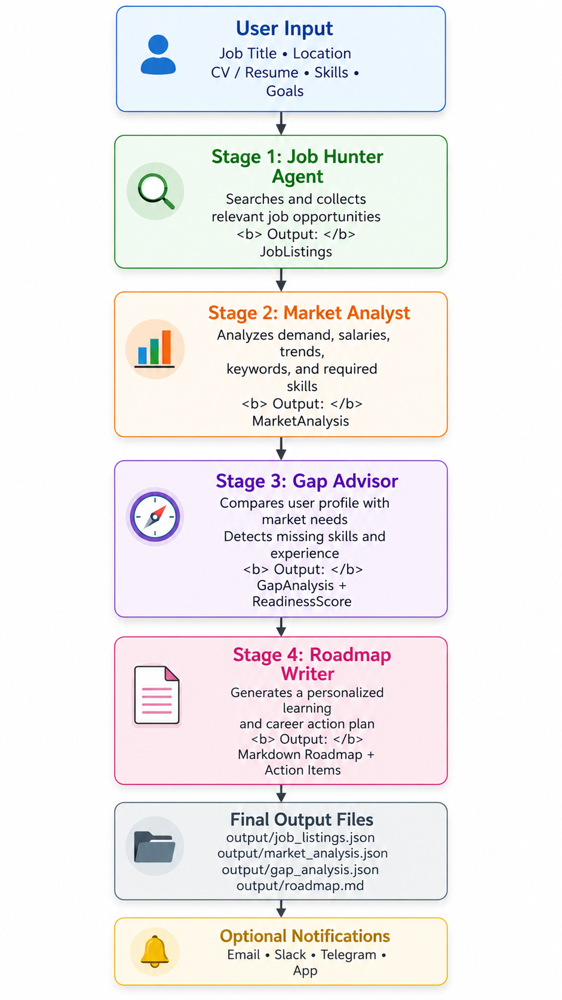
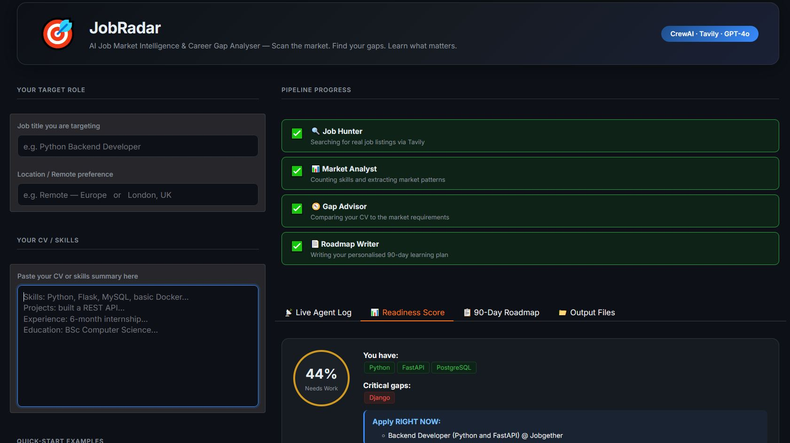

# 🎯 JobRadar : AI-Powered Job Market Intelligence & Career Gap Analyzer

> **Scan the market. Find your gaps. Learn what matters.**

A multi-agent CrewAI pipeline that analyzes job market requirements, compares them to your CV, calculates a readiness score, and generates a personalized 90-day learning roadmap.

---

## 🌟 Features

- **🔍 Job Hunter Agent** : Finds real, currently-open job listings via web search
- **📊 Market Analyst Agent** : Extracts and quantifies skills demand from job postings
- **🧭 Gap Advisor Agent** : Compares your CV against market requirements and calculates readiness score
- **📄 Roadmap Writer Agent** : Generates a structured 90-day learning plan with resources and projects
- **🎛️ Director Agent** : Hierarchical orchestration ensuring quality outputs at each stage
- **💾 Memory System** : Long-term memory persistence with CrewAI embeddings
- **🎨 Gradio Dashboard** : Beautiful web UI with live agent log streaming and result visualization
- **📲 Notifications** : Optional integration with ntfy.sh (push) and Resend (email)

---

## 📸 Dashboard Preview



*Replace the placeholder above with a screenshot of the app.py Gradio dashboard*

---

## 🏗️ Architecture



---

## 🚀 Quick Start

### Prerequisites

- Python 3.10 – 3.12
- OpenAI API key ([get one](https://platform.openai.com/account/api-keys))
- Tavily API key ([get one](https://tavily.com))
- Virtual environment (venv)

### Installation

1. **Clone and navigate:**
   ```bash
   git clone <your-repo-url>
   cd ai_research_crew
   ```

2. **Create virtual environment:**
   ```bash
   python -m venv .venv
   & .\.venv\Scripts\Activate.ps1          # Windows
   # or
   source .venv/bin/activate               # macOS/Linux
   ```

3. **Install dependencies:**
   ```bash
   pip install --upgrade pip
   pip install crewai[tools]==1.14.4 openai gradio python-dotenv tavily-python
   ```

4. **Set up `.env`:**
   ```env
   OPENAI_API_KEY=sk-...
   TAVILY_API_KEY=...
   # Optional:
   NTFY_TOPIC=jobradar-alerts
   RESEND_API_KEY=...
   REPORT_FROM=you@example.com
   REPORT_TO=recipient@example.com
   ```

---

## 📖 Usage

### Option 1 : CLI (Interactive)

```bash
python -m ai_research_crew.main
```

You'll be prompted to enter:
- Job title you're targeting
- Location/Remote preference
- Your CV or skills summary

Outputs saved to `output/`:
- `01_job_listings.json`
- `02_market_analysis.json`
- `03_gap_analysis.json`
- `04_learning_roadmap.md`

### Option 2 : Gradio Web Dashboard

```bash
python app.py
```

Opens a beautiful dashboard where you can:
- Fill in job details
- See live agent logs as they work
- View your readiness score visually
- Download your personalized 90-day roadmap
- Browse all generated output files

---

## 📋 Output Example

### Gap Analysis (`03_gap_analysis.json`)

```json
{
  "readiness_score": 62,
  "readiness_label": "Needs Work",
  "skills_you_have": ["Python", "Flask", "MySQL", "Git"],
  "critical_gaps": ["FastAPI", "Docker", "PostgreSQL"],
  "apply_now_jobs": [
    "Junior Python Developer @ Company A",
    "Backend Developer (Flask) @ Company B"
  ],
  "apply_in_3_months": [
    "Senior Backend Engineer @ Company C",
    "DevOps Engineer @ Company D"
  ]
}
```

### Learning Roadmap (`04_learning_roadmap.md`)

```markdown
# Your 90-Day Career Roadmap: Python Backend Developer

> Readiness Score: 62% — Needs Work
> You have strong Python fundamentals and web development experience.

## Apply RIGHT NOW
- Junior Python Developer @ Company A
- Backend Developer (Flask) @ Company B

## Month 1 — Learn: FastAPI
**Why:** FastAPI appears in 85% of listings you cannot currently apply to.
**Resource:** Full FastAPI Course — https://...
**Mini-project:** Build a FastAPI task management API with PostgreSQL
...
```

---

## 🛠️ Project Structure

```
ai_research_crew/
├── src/ai_research_crew/
│   ├── crew.py                 # CrewAI orchestration
│   ├── main.py                 # CLI entry point
│   ├── models.py               # Pydantic data contracts
│   ├── config/
│   │   ├── agents.yaml         # Agent definitions
│   │   └── tasks.yaml          # Task definitions
│   └── tools/
│       ├── fetch_tool.py       # Web page fetcher
│       ├── notify_tool.py      # Notifications
│       └── custom_tool.py      # Template for custom tools
├── app.py                      # Gradio dashboard
├── pyproject.toml              # Dependencies
├── .env.example                # Environment template
├── instructions.md             # Detailed setup guide
└── output/                     # Generated results
```

---

## 🔧 Customization

### Modify Agents
Edit `src/ai_research_crew/config/agents.yaml`:
```yaml
job_hunter:
  role: >
    Job Market Scout
  goal: >
    Find 10-15 real job listings...
  backstory: >
    You are a career research specialist...
  llm: openai/gpt-4o-mini
```

### Modify Tasks
Edit `src/ai_research_crew/config/tasks.yaml`:
```yaml
hunt_task:
  description: >
    Search the internet for real job listings...
  expected_output: >
    A structured list of 8-15 verified job postings...
  agent: job_hunter
  output_file: output/01_job_listings.json
```

### Add Custom Tools
Create a new tool in `src/ai_research_crew/tools/`:
```python
from crewai.tools import BaseTool
from pydantic import BaseModel, Field

class MyToolInput(BaseModel):
    query: str = Field(description="Query string")

class MyTool(BaseTool):
    name: str = "My Tool"
    description: str = "Description of what this tool does"
    args_schema: type[BaseModel] = MyToolInput

    def _run(self, query: str) -> str:
        # Implementation
        return result
```

---

## 📚 Understanding the Pipeline

1. **Stage 1 : Job Hunter** → Finds real job postings via Tavily web search
2. **Stage 2 : Market Analyst** → Counts skill frequencies, identifies tech stacks
3. **Stage 3 : Gap Advisor** → Compares your CV to market requirements
4. **Stage 4 : Roadmap Writer** → Generates personalized 90-day learning plan

Each stage receives the output from the previous stage(s) as context, ensuring data flows correctly through the pipeline.

---

## 🐛 Troubleshooting

### 403 Embedding Permission Error :
Your API key doesn't have access to embeddings. Try:
```python
# In src/ai_research_crew/crew.py
embedder={
    "provider": "openai",
    "config": {"model_name": "text-embedding-3-small"},  # Switch to smaller model
}
# Or temporarily disable memory:
memory=False,
```

### Missing Environment Variables :
Ensure your `.env` contains:
```env
OPENAI_API_KEY=sk-...
TAVILY_API_KEY=...
```

### `readiness_score` = 0 :
Your CV doesn't match any critical skills in the job market. Check `output/03_gap_analysis.json` for which skills are critical but missing from your profile.

---

## 📖 Full Documentation

For detailed setup, customization, and troubleshooting, see [instructions.md](./instructions.md).

---

## 🤝 Contributing

Contributions are welcome! Please:
1. Fork the repo
2. Create a feature branch (`git checkout -b feature/my-feature`)
3. Commit changes (`git commit -am 'Add my feature'`)
4. Push to branch (`git push origin feature/my-feature`)
5. Open a Pull Request

---

## 📄 License

This project is licensed under the MIT License — see [LICENSE](./LICENSE) for details.

---

## 🙏 Acknowledgments

- Built with [CrewAI](https://crewai.com) — the framework for orchestrating AI agents
- Web search powered by [Tavily](https://tavily.com)
- LLM by [OpenAI](https://openai.com)
- UI by [Gradio](https://www.gradio.app)
- Notifications via [ntfy.sh](https://ntfy.sh) and [Resend](https://resend.com)

---

## 📞 Support

- 📖 **Documentation:** [instructions.md](./instructions.md)
- 🐛 **Issues:** [GitHub Issues](../../issues)
- 💬 **Questions:** Open a discussion or issue

---

**Made with ❤️ for developers who want to understand the job market and close their skill gaps.**
