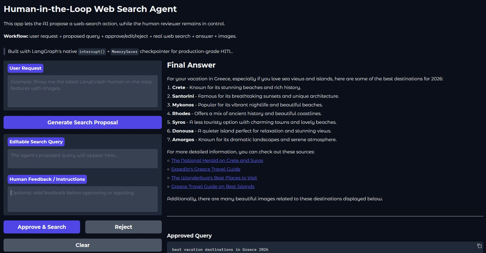
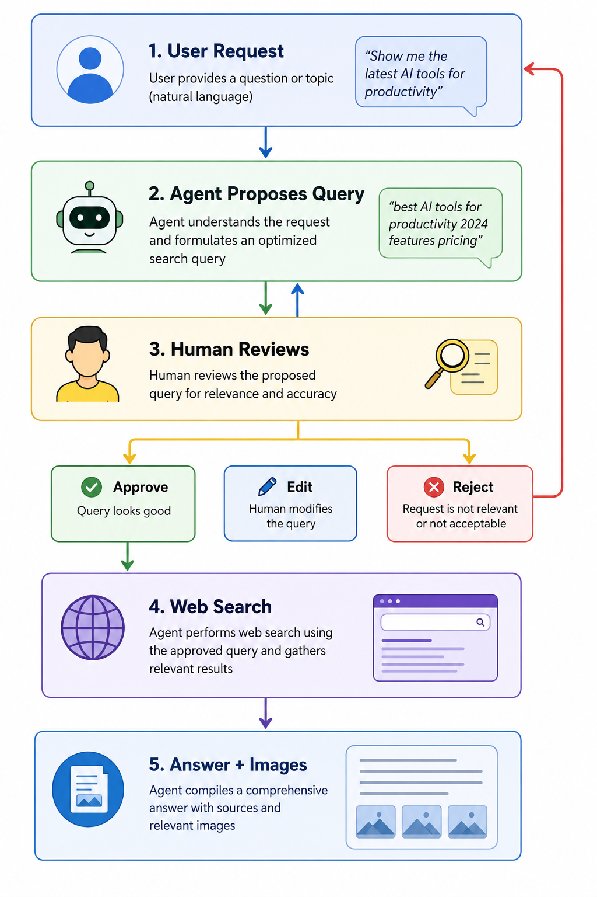

# Human-in-the-Loop Web Search Agent

A production-grade **Gradio + LangGraph** application that implements a human-in-the-loop
web search workflow using OpenAI and Tavily.

Built with LangGraph's native `interrupt()` + `MemorySaver` checkpointer for
proper HITL orchestration — the human genuinely controls whether a search happens,
with full state persistence across the interrupt/resume cycle.

## 📸 Dashboard Preview




## Workflow

```
User Request → Agent Proposes Query → Human Reviews → Approve / Edit / Reject → Web Search → Answer + Images
```



1. **User enters a request** — clicks *Generate Search Proposal*.
2. **Agent proposes** a search query and explains the planned action (via `gpt-4o-mini` structured output).
3. **Graph interrupts** — waits for human review via `interrupt()`.
4. **Human reviews** — can edit the query, add feedback, then **Approve** or **Reject**.
5. **Graph resumes** — via `Command(resume=...)` with the human's decision.
6. **If approved** — Tavily web search runs (with retry) → LLM summarises results → images displayed.
7. **If rejected** — graph routes to END, no search is executed.

## Architecture

```
Single Unified Graph (with MemorySaver checkpointer)

    START → propose_action → human_review (interrupt)
          → route: approved  → execute_web_search → summarize → END
          → route: rejected  → END
```

### Key Production Features

| Feature | Implementation |
|---------|---------------|
| **Native HITL** | LangGraph `interrupt()` + `Command(resume=...)` |
| **Checkpointing** | `MemorySaver` — thread-based state persistence |
| **Structured Output** | Pydantic `ProposalOutput` via `llm.with_structured_output()` |
| **Retry Logic** | `tenacity` — 3 attempts with exponential backoff on web search |
| **Configuration** | `pydantic-settings` `BaseSettings` — type-validated at startup |
| **Logging** | Structured Python `logging` throughout all modules |
| **Error Handling** | Custom exception hierarchy (`ProposalError`, `SearchError`, `ResumeError`) |
| **Testability** | Factory functions instead of module-level singletons |

## Project Structure

```
hitl_search_agent/
├── .env                        # Your real API keys (git-ignored)
├── .env.example                # Template
├── pyproject.toml              # Project metadata & dependencies
├── README.md
├── RUN.md                      # Step-by-step setup & run instructions
│
├── src/
│   └── hitl_search_agent/
│       ├── main.py             # Entry point
│       ├── config.py           # pydantic-settings configuration
│       ├── logging_config.py   # Structured logging setup
│       ├── domain/
│       │   ├── state.py        # HITLSearchState + HumanDecision
│       │   └── models.py       # Pydantic ProposalOutput
│       ├── infrastructure/
│       │   ├── llm.py          # LLM factory (ChatOpenAI)
│       │   └── web_search.py   # Tavily search factory
│       ├── prompts/
│       │   ├── proposal_prompts.py
│       │   └── summary_prompts.py
│       ├── graph/
│       │   ├── nodes.py        # propose, human_review (interrupt), search, summarize
│       │   └── builder.py      # Unified graph with MemorySaver
│       ├── services/
│       │   └── search_workflow_service.py  # Thread-based invoke/resume
│       ├── ui/
│       │   ├── gradio_app.py   # Gradio layout with thread_id state
│       │   └── handlers.py     # Event handlers
│       └── utils/
│           ├── errors.py       # Custom exceptions
│           └── image_utils.py  # Tavily image extraction
│
└── tests/                      # 31 tests (unit + integration)
    ├── test_config.py
    ├── test_image_utils.py
    ├── test_integration.py     # Full interrupt/resume cycle
    ├── test_nodes.py
    └── test_workflow.py
```

## Quick Start

```bash
# 1. Create a virtual environment
python -m venv .venv
.venv\Scripts\activate        # Windows
# source .venv/bin/activate   # macOS / Linux

# 2. Install in editable mode
pip install -e ".[dev]"

# 3. Add your API keys to .env
cp .env.example .env
# Edit .env with your real keys

# 4. Run the app
python -m hitl_search_agent
```

The Gradio UI will launch at **http://127.0.0.1:7860**.

> See [RUN.md](RUN.md) for detailed step-by-step instructions with explanations.

## Running Tests

```bash
# All tests
pytest -v

# With coverage
pytest -v --cov=hitl_search_agent --cov-report=term-missing

# Integration tests only
pytest tests/test_integration.py -v
```

## Required Environment Variables

| Variable | Description |
|---|---|
| `OPENAI_API_KEY` | OpenAI API key |
| `TAVILY_API_KEY` | Tavily API key for web search |

### Optional

| Variable | Default | Description |
|---|---|---|
| `LLM_MODEL` | `gpt-4o-mini` | OpenAI model name |
| `LLM_TEMPERATURE` | `0.0` | LLM temperature |
| `TAVILY_MAX_RESULTS` | `5` | Max search results |
| `SERVER_HOST` | `127.0.0.1` | Gradio server host |
| `SERVER_PORT` | `7860` | Gradio server port |
| `LOG_LEVEL` | `INFO` | Logging level |

## Tech Stack

- **LangGraph** — unified stateful graph with `interrupt()` + `MemorySaver` checkpointer
- **LangChain + OpenAI** — LLM integration (`gpt-4o-mini`) with structured output
- **Tavily** — real-time web search with images
- **Gradio** — interactive web UI
- **Pydantic** — structured LLM output + settings validation
- **Tenacity** — retry logic with exponential backoff
- **python-dotenv** — environment variable management
