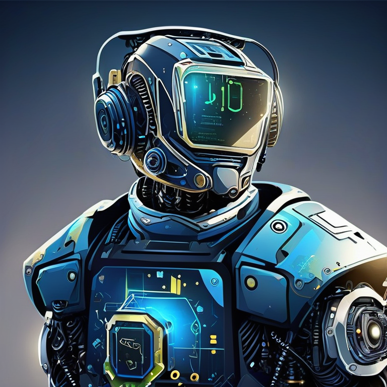
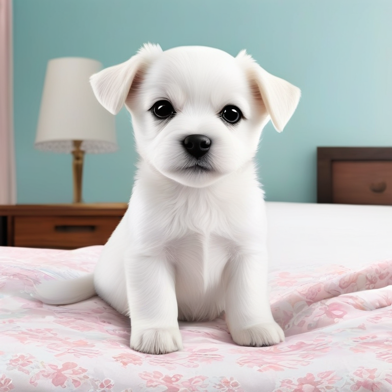
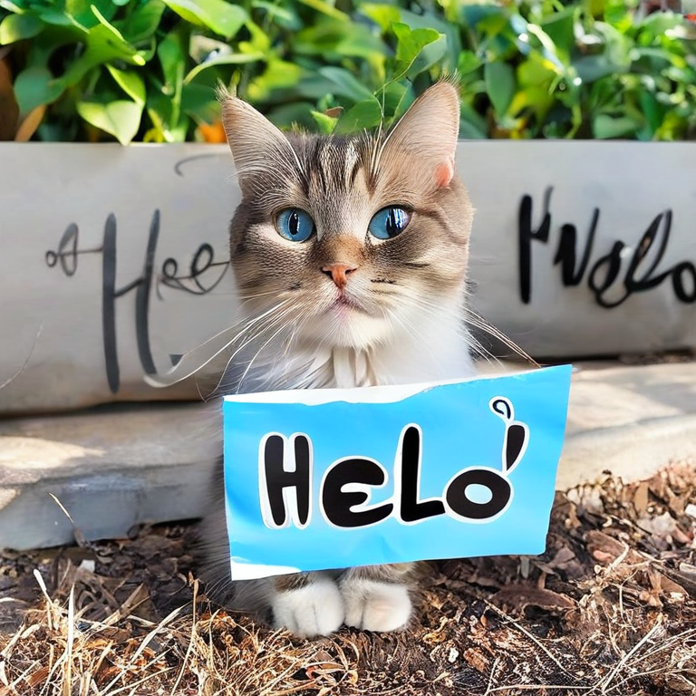

# Text-to-Image Generator

A Python application that generates high-quality images from text prompts using Stable Diffusion XL and the lightweight SSD-1B model from Hugging Face.

## Features

- 🎨 **Text-to-Image Generation**: Convert natural language descriptions into images
- ⚡ **GPU Acceleration**: Automatic GPU detection and optimization with CUDA support
- 💾 **Memory Efficient**: CPU offloading for limited VRAM environments
- 🔄 **Reproducible Results**: Fixed seed for consistent image generation
- 🖥️ **CPU Fallback**: Works on systems without GPU (slower but compatible)
- 🎯 **Quality Control**: Configurable guidance scale and inference steps
- ⛔ **Negative Prompts**: Support for negative prompts to avoid unwanted features

## Requirements

- **Python 3.8+**
- **PyTorch** (with CUDA support recommended)
- **CUDA 11.8+** (optional, for GPU acceleration)

## Installation

### 1. Clone or download this project

```bash
cd demo-hf
```

### 2. Create a virtual environment (recommended)

```bash
# Using venv
python -m venv venv
source venv/Scripts/activate  # On Windows
# or
source venv/bin/activate      # On Linux/Mac
```

### 3. Install dependencies

```bash
pip install -r requirements.txt
```

### 4. Download Hugging Face model (optional, first run)

The model will be automatically downloaded on the first run. You may need to set up Hugging Face credentials for large models:

```bash
huggingface-cli login
```

## Usage

Run the script:

```bash
python text_to_image.py
```

You'll be prompted to enter:
1. **Your prompt**: Describe the image you want to generate (e.g., "A serene mountain landscape at sunset")
2. **Output image name**: Filename for the generated image (without extension, e.g., "my_image")

The generated image will be saved as a PNG file in the current directory.

### Example

```
Enter your prompt: A futuristic city with flying cars at night
Enter the output image name (without extension): future_city
```

This creates `future_city.png` with the generated image.

## Gallery / Example Outputs

Here are some example images generated with this tool:

| Prompt | Output |
|--------|--------|
| "AI for Developers - AI Agents" |  |
| "A happy white puppy sitting on the bed" |  |
| "A beautiful cat with helo message" |  |

*Generated images are saved to the `output/` directory for easy organization and reference.*

## Configuration

You can modify the following parameters in `text_to_image.py` to customize the generation:

```python
image = pipe(
    prompt=prompt,
    height=768,              # Image height (default: 768)
    width=768,               # Image width (default: 768)
    num_inference_steps=25,  # Higher = better quality but slower (25-50 recommended)
    guidance_scale=9.0,      # Higher = closer to prompt (7.5-15 typical)
    negative_prompt="...",   # Features to avoid
    generator=generator
)
```

### Parameter Guide

- **height/width**: Output image dimensions. Common values: 512, 576, 640, 704, 768
- **num_inference_steps**: Number of denoising iterations (default: 25, range: 10-50)
- **guidance_scale**: How strongly to follow the prompt (default: 9.0, range: 1.0-15.0)
- **negative_prompt**: Characteristics to avoid in generation

## Performance Notes

### GPU (CUDA)
- Uses `float16` for reduced VRAM consumption
- Enables CPU offloading for memory management
- Much faster generation (typically 5-30 seconds per image)

### CPU
- Uses `float32` for better compatibility
- Slower generation (typically 2-5 minutes per image)
- No VRAM concerns
- Recommended for systems without NVIDIA GPU

## Model Details

- **Model Name**: Segmind SSD-1B
- **Size**: ~1.4GB (downloaded to `~/.cache/huggingface/`)
- **Training Data**: Based on SDXL architecture
- **License**: Check Hugging Face model card for license details

## Troubleshooting

### Out of Memory (OOM) Error
- Reduce `height` and `width` to 512 or 576
- Reduce `num_inference_steps` to 15-20
- Enable CPU offloading (already enabled for GPU in the script)

### Model Download Fails
- Check your internet connection
- Ensure sufficient disk space (~2GB)
- Try: `huggingface-cli login` and enter your Hugging Face token

### CUDA Not Detected
- Verify NVIDIA driver: `nvidia-smi`
- Reinstall PyTorch with CUDA: `pip install torch torchvision torchaudio --index-url https://download.pytorch.org/whl/cu118`

### Slow Generation on GPU
- Check VRAM usage with `nvidia-smi`
- Reduce image resolution or inference steps
- Close other GPU-using applications

## Project Structure

```
demo-hf/
├── text_to_image.py      # Main script
├── requirements.txt      # Python dependencies
├── README.md            # This file
└── output/              # Generated images directory
    ├── ai-for-developers.png
    ├── happy-puppy.png
    ├── cat.png
    └── (other generated images)
```

## Dependencies Summary

- **torch, torchvision, torchaudio**: Deep learning framework
- **diffusers**: Hugging Face diffusion models library
- **transformers**: Model handling and tokenization
- **pillow**: Image processing
- **accelerate**: Optimization for GPU/CPU
- **safetensors**: Secure model loading

## License

This script uses the Stable Diffusion model. Check the model's license on [Hugging Face](https://huggingface.co/segmind/SSD-1B) for usage terms.

## Resources

- [Hugging Face Diffusers Documentation](https://huggingface.co/docs/diffusers)
- [Segmind SSD-1B Model Card](https://huggingface.co/segmind/SSD-1B)
- [Stable Diffusion XL](https://stability.ai/blog/stable-diffusion-3)

## Tips for Best Results

1. **Be descriptive**: "A red apple on a wooden table" works better than "apple"
2. **Specify style**: "oil painting", "photograph", "digital art", etc.
3. **Use negative prompts**: Avoid common issues like "blurry" or "low quality"
4. **Experiment with guidance_scale**: 7.5-12 usually gives good results
5. **Try multiple prompts**: Generation varies even with the same seed

---

**Happy generating!** 🎨
